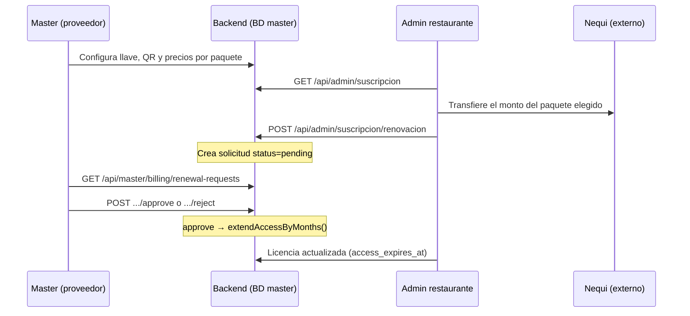

# Renovación de suscripción (Nequi)

Flujo **semi-automático**: el admin del restaurante paga por Nequi fuera del sistema, notifica la referencia, y el **Master** confirma o rechaza manualmente. No hay webhook de Nequi.

Relacionado: [TENANCY.md](./TENANCY.md) (multi-tenant y licencias), [AUTH.md](./AUTH.md) (login Master/admin).

---

## Resumen del flujo



---

## Pantallas y URLs (local)

| Paso | Rol | URL | Pestaña / ruta |
|------|-----|-----|----------------|
| Configurar Nequi | Master | http://master.localhost:5173/master/login | Dashboard → **Ajustes** → *Pagos Nequi (renovaciones)* |
| Renovar | Admin tenant | http://{slug}.localhost:5173/admin/configuracion#suscripcion | Configuración → *Suscripción y licencia*; también desde el banner |
| Confirmar pago | Master | http://master.localhost:5173/master/dashboard | **Pagos** |

**Login staff admin:** http://{slug}.localhost:5173/staff?rol=admin

Tras `git pull`, si el frontend falla al cargar módulos nuevos (p. ej. facturas PDF), ejecuta `npm install` en `frontend/` (incluye `jspdf`).

---

## 1. Configuración Master (una vez o cuando cambien precios)

**UI:** Master → **Ajustes** → sección *Pagos Nequi (renovaciones)*.

| Campo | Descripción |
|-------|-------------|
| Llave o número Nequi | Visible para todos los admins de restaurantes |
| QR Nequi | Imagen JPG/PNG/WebP (máx. 4 MB); se guarda en storage de plataforma |
| Precios por paquete | Totales fijos para **1, 3, 6 y 12 meses** (COP) |

**Precios por defecto** (si no se configuran otros):

| Paquete | COP |
|---------|-----|
| 1 mes | 50.000 |
| 3 meses | 140.000 |
| 6 meses | 270.000 |
| 12 meses | 500.000 |

Cada paquete es un **precio fijo**, no es `meses × precio mensual`.

**API:**

| Método | Ruta | Auth |
|--------|------|------|
| GET | `/api/master/billing/settings` | Master |
| POST o PUT | `/api/master/billing/settings` | Master |

Ejemplo cuerpo `POST`:

```json
{
  "nequi_key": "@3165728348",
  "price_1_month_cop": 50000,
  "price_3_months_cop": 140000,
  "price_6_months_cop": 270000,
  "price_12_months_cop": 500000
}
```

El QR se envía como `multipart/form-data` con campo `nequi_qr`.

**Tabla master:** `platform_billing_settings` (una fila global por plataforma).

---

## 2. Aviso al admin (licencia por vencer)

Si el tenant tiene `access_expires_at` y quedan **≤ N días** (`TENANT_LICENSE_WARNING_DAYS`, default **7**), el panel admin muestra un banner con enlace a **Renovar suscripción**.

**API:** `GET /api/admin/licencia` → `show_warning`, `days_remaining`, `message`.

**Componentes:** `AdminLicenseBanner.jsx`, sección en `AdminConfiguracionPage` (`AdminSubscriptionPanel.jsx`).

---

## 3. Admin notifica el pago

**UI:** Configuración → sección *Suscripción y licencia* (`/admin/configuracion#suscripcion`)

1. Ve estado de licencia (vencimiento, días restantes).
2. Escanea QR o copia la llave Nequi configurada por Master.
3. Elige paquete (1 / 3 / 6 / 12 meses) y el total en COP.
4. Realiza la transferencia en Nequi (fuera de la app).
5. Pulsa **Notificar pago** con:
   - **Referencia Nequi** (mín. 3 caracteres), p. ej. `M987654321`
   - **Nota opcional** (horario, titular, etc.)

**Reglas:**

- Solo en modo `TENANCY_MODE=multi`.
- **Una solicitud `pending` por restaurante.** Si ya hay una, no se puede enviar otra hasta que Master la apruebe o rechace.
- Tras enviar, el formulario se oculta y aparece *Solicitud en revisión*.

**API:**

| Método | Ruta | Auth |
|--------|------|------|
| GET | `/api/admin/suscripcion` | Admin (Bearer + tenant) |
| POST | `/api/admin/suscripcion/renovacion` | Admin |

Ejemplo `POST`:

```json
{
  "months": 3,
  "payment_reference": "M987654321",
  "admin_note": "Pago 10:30 am"
}
```

Respuesta `201`: solicitud con `status: pending`, `amount_cop` según precio del paquete en ese momento.

**Tabla master:** `subscription_renewal_requests`.

---

## 4. Master confirma o rechaza

**UI:** Master → **Pagos** → lista *Pagos Nequi pendientes*.

Por cada solicitud se muestra: restaurante, meses, monto, referencia, nota del admin, vencimiento actual de licencia.

| Botón | Efecto |
|-------|--------|
| **Confirmar pago** | Aprueba y extiende licencia |
| **Rechazar** | Marca rechazada; el admin puede enviar otra solicitud |

**API:**

| Método | Ruta |
|--------|------|
| GET | `/api/master/billing/renewal-requests` | Solo pendientes |
| GET | `/api/master/billing/renewal-history` | Historial paginado (`status`, `q`, `page`, `per_page`) |
| POST | `/api/master/billing/renewal-requests/{id}/approve` |
| POST | `/api/master/billing/renewal-requests/{id}/reject` |

Cuerpo opcional en approve/reject:

```json
{ "master_note": "Verificado en extracto Nequi" }
```

**Al aprobar** (`Tenant::extendAccessByMonths`):

- Si `access_expires_at` **aún no venció** → suma meses **desde esa fecha**.
- Si **ya venció** → suma meses **desde hoy**.
- Quita `access_cancel_at_period_end`.
- Si el tenant estaba `suspended` → pasa a `active`.

**Al rechazar:** no se modifica la licencia; el admin vuelve a ver el formulario de pago.

---

## Estados de solicitud

| status | Significado |
|--------|-------------|
| `pending` | Esperando revisión Master |
| `approved` | Pago confirmado; licencia extendida |
| `rejected` | Rechazada; admin puede reintentar |

---

## Variables de entorno

```env
# Meses al completar onboarding (0 = sin vencimiento; fallback si la invitación no trae meses)
TENANT_DEFAULT_LICENSE_MONTHS=1

# Días antes del vencimiento para avisar al admin del restaurante
TENANT_LICENSE_WARNING_DAYS=7
```

Clientes antiguos pueden tener `access_expires_at` null (sin límite) hasta que Master asigne meses manualmente o llegue una renovación aprobada.

---

## Prueba local (checklist)

### Requisitos

```bash
cd backend
php artisan master:migrate --seed   # tablas platform_billing_settings, subscription_renewal_requests
php artisan serve

cd frontend
npm install
npm run dev
```

### Credenciales de ejemplo

| Rol | Acceso | Notas |
|-----|--------|-------|
| Master | `master@local.test` / `master123` | Puede tener **2FA** activo; ver [AUTH.md](./AUTH.md) |
| Admin tenant `turestaurante` | http://turestaurante.localhost:5173/staff?rol=admin | Usuario creado en onboarding del tenant (p. ej. `admin@turestaurante.test`) |

### Recorrido manual

1. Master → **Ajustes** → guardar Nequi + precios + QR.
2. Admin → **Configuración** → *Suscripción y licencia* → elegir 3 meses → referencia de prueba → **Notificar pago**.
3. Master → **Pagos** → **Confirmar pago**.
4. Admin → recargar suscripción: nueva fecha de vencimiento y formulario disponible de nuevo.

### Ejemplo verificado (tenant `turestaurante`)

| Evento | Valor |
|--------|-------|
| Vencimiento antes | 15/06/2026 |
| Paquete | 3 meses — $140.000 |
| Referencia | `M987654321` |
| Vencimiento después de aprobar | 15/09/2026 (+3 meses desde vencimiento previo) |

---

## Tests automatizados

```bash
cd backend
php artisan test --filter=MasterBillingRenewalTest
```

Cubre: actualización de ajustes Master, envío admin, aprobación Master, bloqueo de segunda solicitud pendiente.

---

## Archivos principales

| Área | Archivo |
|------|---------|
| Master UI ajustes | `frontend/src/src/components/MasterSettingsPanel.jsx` |
| Master UI pagos | `frontend/src/src/components/MasterBillingRenewalsPanel.jsx` |
| Admin UI renovación | `frontend/src/src/components/AdminSubscriptionPanel.jsx` (en `AdminConfiguracionPage`) |
| Banner licencia | `frontend/src/src/components/AdminLicenseBanner.jsx` |
| API Master | `backend/app/Http/Controllers/Api/Master/MasterBillingController.php` |
| API Admin | `backend/app/Http/Controllers/Api/AdminSubscriptionController.php` |
| Licencia / aviso | `backend/app/Http/Controllers/Api/AdminLicenseController.php` |
| Extender meses | `backend/app/Models/Master/Tenant.php` → `extendAccessByMonths()` |
| Migraciones master | `database/migrations/master/2026_06_12_000001_*`, `2026_06_12_000002_*` |

---

## Limitaciones y producción

- **No hay integración API/webhook Nequi.** La verificación del pago es manual.
- El QR Nequi requiere `php artisan storage:link` en el backend para servir imágenes públicas.
- Master en producción exige contraseña fuerte (`MasterPasswordPolicy`); ver [AUTH.md](./AUTH.md).
- La renovación **no está disponible** en `TENANCY_MODE=single` (`renewal_available: false` en API).
