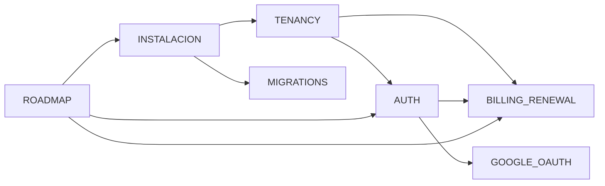

# Documentación — proyectoLibre_Restaurante

SaaS multi-tenant: Laravel 13 (backend) + React 19 (frontend). Master en `master.localhost:5173`, tenants en `{slug}.localhost:5173`, API en `:8000`.

---

## Por dónde empezar

| Documento | Contenido |
|-----------|-----------|
| [INSTALACION.md](./INSTALACION.md) | Requisitos, `.env`, migraciones, arranque local |
| [TENANCY.md](./TENANCY.md) | Multi-tenant, invitaciones, licencias, subdominios |
| [AUTH.md](./AUTH.md) | Login staff/admin/cliente, 2FA Master, throttling |
| [ROADMAP.md](./ROADMAP.md) | Fases del producto y estado de cada tarea |

---

## Temas específicos

| Documento | Contenido |
|-----------|-----------|
| [BILLING_RENEWAL.md](./BILLING_RENEWAL.md) | Renovación Nequi: Master (ajustes/pagos) + admin (Configuración → Suscripción) |
| [MIGRATIONS.md](./MIGRATIONS.md) | Flujo único de migraciones master vs tenant |
| [GOOGLE_OAUTH.md](./GOOGLE_OAUTH.md) | OAuth Google (cliente y exchange de código) |

---

## Mapa rápido de URLs (local)

| Rol | URL |
|-----|-----|
| Master login | http://master.localhost:5173/master/login |
| Master dashboard | http://master.localhost:5173/master/dashboard |
| Admin tenant | http://{slug}.localhost:5173/staff?rol=admin |
| Renovación suscripción | http://{slug}.localhost:5173/admin/configuracion#suscripcion |
| Cliente | http://{slug}.localhost:5173/cliente |

---

## Comandos habituales

```bash
# Backend
cd backend
php artisan master:migrate --seed
php artisan serve

# Frontend
cd frontend
npm install
npm run dev

# Tests billing
php artisan test --filter=MasterBillingRenewal
```

---

## Relación entre docs


